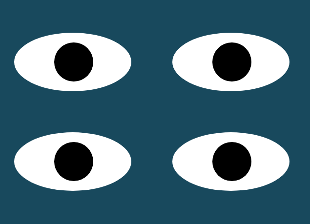

# Eyes-Exercise

Coding exercise to implement a set of moving eyes in the web-browser.
Copy the files for a folder on your hard disk and execute index.html
Make sure the png files are on the same folder in order to see the eyes eerily following the mouse

